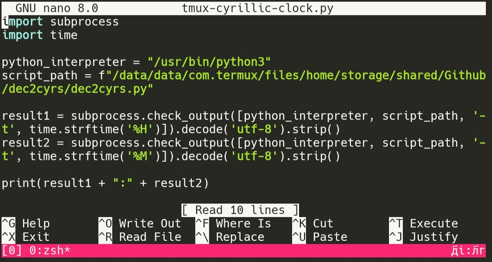

## Tmux Cyrillic Clock

This script displays the current time in Cyrillic numerals within your tmux status bar.

Requirements:

* Python 3 or Bash
* [dec2cyrs](https://github.com/slovjinika/dec2cyrs)

Installation:

1. Clone this repository:

`git clone https://github.com/slovjinika/tmux-cyrillic-clock.git`

2. Place the `dec2cyrs.py` script in a location accessible to your tmux configuration. For example, you can move it to /data/data/com.termux/files/home/storage/shared/Github/dec2cyrs/ on Termux.

3. Add the following lines to your tmux.conf file:

`set-option -g status-right "#(python /data/data/com.termux/files/home/storage/shared/Github/dec2cyrs/tmux-cyrillic-clock.py)"`

Usage:

1. Restart your tmux server:

`tmux kill-server`

`tmux`

2. The Cyrillic time should now be displayed on the right side of your tmux status bar.

Customization:

* You can adjust the position of the clock in your tmux status bar by modifying the status-right setting in your tmux.conf file.
* If you want to use a different Python interpreter, modify the python_interpreter variable in the script.
* If you want to change the location of the dec2cyrs.py script, update the script_path variable accordingly.

Notes:

* The dec2cyrs.py script is responsible for converting decimal numbers to Cyrillic numerals.
* The Cyrillic characters are displayed using the default font of your terminal emulator.
